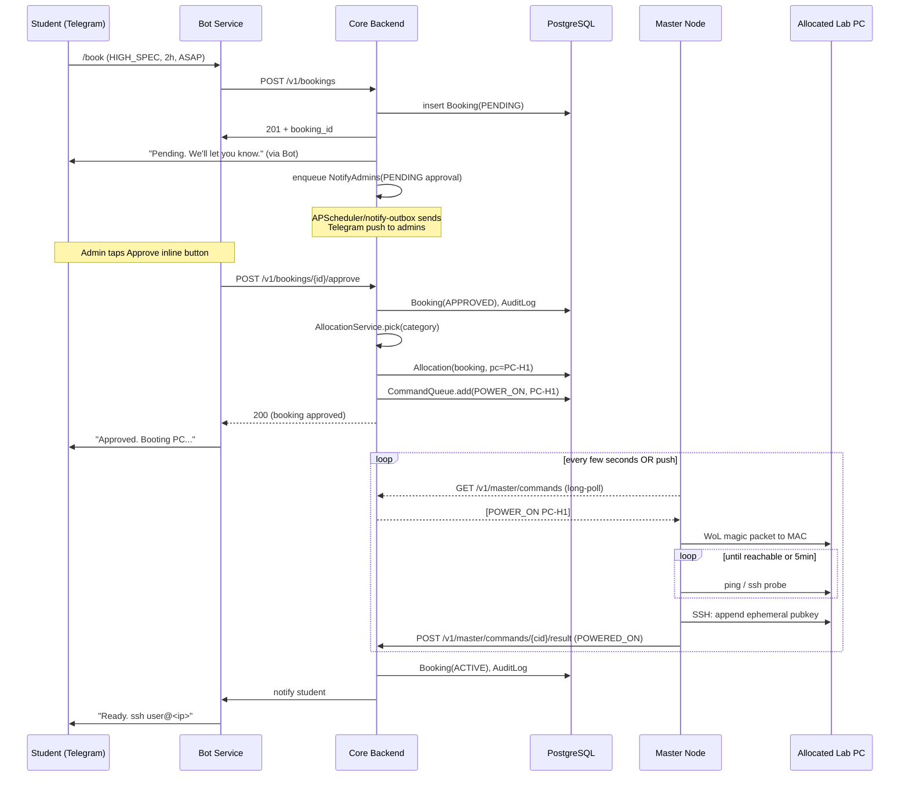

# System Design Document (SDD)
## ReDA Lab Resource Manager

**Document Status:** Draft v1.0
**Last Updated:** 2026-06-30
**Owner:** ReDA Labs IT

> Companion to `SRS.md`. This document is the authoritative design source. Cross-cutting requirements trace back to the SRS by their IDs (FR-x / NFR-x).

---

## 1. Overview

### 1.1 Purpose
Define the architecture, components, data flow, technology choices, deployment topology, and key engineering decisions for the ReDA Lab Resource Manager.

### 1.2 Design Goals
1. **Minimize human steps** — a student's round-trip from "I want a PC" to "I'm SSH'd in" should be: send `/book` → confirm → wait for approval → receive SSH details.
2. **Operate behind a NAT'd lab** — the cloud backend must never need to dial into the lab directly; the master node initiates all connections out.
3. **Be idempotent and recoverable** — every command and notification must be safe to retry; no state held only in memory.
4. **Be observable** — admins can see at any moment what the system is doing and why.

### 1.3 System Context Diagram

```
                +----------------------+
                |  Telegram Platform   |
                +----------+-----------+
                           | (Long-poll or Webhook)
                           v
+-----------------------------------------------------------------------+
|                          Cloud (single VM)                             |
|  +-------------------+        +---------------------+                  |
|  |   Bot Service     | <----> |   Core Backend      |                 |
|  | (python-telegram- |        | (FastAPI app:       |                 |
|  |  bot, async)      |        |  REST + scheduler)  |                 |
|  +-------------------+        +---------+-----------+                 |
|                                          |                            |
|                                          v                            |
|                                +-----------------+                    |
|                                |   PostgreSQL    |                    |
|                                +-----------------+                    |
+-----------------------------------------------------------------------+
                                            ^
                                            | (HTTPS reverse tunnel:
                                            |  Cloudflare Tunnel / Tailscale)
                                            v
+-----------------------------------------------------------------------+
|                Lab LAN (behind NAT/firewall)                          |
|                                                                        |
|  +----------------------+         +--------------------------------+   |
|  |   Master Node (M)    | <-----> |  Lab PCs (24 total)             |   |
|  | - systemd service    |         |  4x HIGH_SPEC (GPU),           |   |
|  | - controller agent   |  WoL   |  20x LOW_SPEC                  |   |
|  | - reverse tunnel CLI  |  SSH   |  Each: SSH server, WoL NIC     |   |
|  +----------------------+  ping  +--------------------------------+   |
+-----------------------------------------------------------------------+
```

---

## 2. Technology Stack

| Concern | Choice | Rationale |
|---|---|---|
| Backend language | **Python 3.11+** | Telegram bot ecosystem, mature async, SSH/WoL libs, easy onboarding for student developers. |
| Backend framework | **FastAPI** | Async, OpenAPI-first (auto-doc), great for REST + cron-style endpoints; pairs with `asyncio`. |
| Bot SDK | **python-telegram-bot v20+** | Async, mature, supports inline keyboards, webhooks, long-polling. |
| Scheduler | **APScheduler** (in-process) | Lightweight, cron + interval triggers, persists jobs to DB via a SQLAlchemy jobstore. |
| ORM | **SQLAlchemy 2.0 (async)** + **Alembic** | Async, mature migration story. |
| Database | **PostgreSQL 15+** | Relational fits booking/allocation; strong constraints; JSONB for config. |
| Process/runtime | **Uvicorn** + **systemd** (or Docker Compose) | One container for backend, one for bot worker (or a single process running both). |
| Master node agent | **Python + httpx + paramiko + `wakeonlan`** | Runs as systemd; speaks HTTPS to backend; handles WoL/SSH. |
| Reverse tunnel | **Tailscale** (preferred) or **Cloudflare Tunnel** | Survives lab NAT; encrypted; Tailscale gives stable IP mesh for free. |
| AuthN/Z | Telegram user ID + internal RBAC table | Avoid password management entirely for end users. |
| Admin web (v1) | FastAPI routes + simple Jinja2/HTMX or `None` (Telegram-only) | Optional; minimized scope. |
| Secrets | `.env` + `python-dotenv`; production via systemd `EnvironmentFile` or Docker secrets | Simplicity for v1; KMS later. |
| Logging | `structlog` JSON to stdout | Stdout-friendly for `docker logs` / `journalctl`. |
| Metrics | `prometheus_client` `/metrics` endpoint + optional Grafana later | Cheap start, future-proof. |
| Containerization | Docker + docker-compose (backend, db, bot) | Reproducible, easy handover. |
| Tests | `pytest` + `pytest-asyncio` + `httpx.AsyncClient` + faker for fixtures | Standard Python stack. |

---

## 3. Component Breakdown

### 3.1 Bot Service (`bot`)
**Responsibilities:**
- Receive Telegram updates (long-poll in dev, webhook in prod).
- Map Telegram User ID → internal User record.
- Implement conversational flows (register, book, mybookings, cancel, help, admin commands).
- Render inline keyboards (Approve/Reject, Cancel, slot pickers).
- Call Core Backend REST API for all mutations/state; **no direct DB access from the bot process** (keeps bot a thin view layer).

**Interface:** Talks to Core Backend over internal HTTP (`http://backend:8000` in the same compose network). Authenticates to backend via a shared service token.

### 3.2 Core Backend (`backend`)
**Responsibilities:**
- Authoritative business logic and DB access (SQLAlchemy async sessions).
- REST API consumed by the Bot Service, the optional Admin Web, and external integrations.
- Scheduler (APScheduler) for slot-end warnings, slot-end shutdowns, no-show detection, PC idle-sweep, waitlist promotion.
- Manages "outbound command queue" to the Master Node (see 3.4).
- Receives callbacks from the Master Node (`status updates`, `power_on success`, `power_on fail`).
- Sends notifications via Bot Service (or directly via Telegram Bot API for service messages) using an outbox table for at-least-once delivery.

**Internal modules:**
```
backend/
  app/
    api/            # FastAPI routers (bookings, pcs, admin, master_node, webhooks)
    commands/      # Command queue → master node
    services/
      booking_service.py
      allocation_service.py
      power_service.py        # orchestrate power_on/off
      notification_service.py # outbox to Telegram
      audit_service.py
    db/            # models, async session
    scheduling/    # APScheduler job definitions
    security/      # RBAC, auth deps
    config.py
  alembic/versions
  tests/
```

### 3.3 Master Node Controller (`master_node`)
**Responsibilities:**
- Establish and maintain a secure outbound channel to the backend (long-poll over HTTPS via reverse tunnel); reconnect with exponential backoff.
- Poll the backend for pending commands addressed to itself (or accept WebSocket push).
- Execute:
  - `POWER_ON`: send WoL magic packet to MAC, poll ping/SSH until reachable or timeout.
  - `INSTALL_KEY`: SSH into PC and append student's pubkey for slot.
  - `REMOVE_KEY`: SSH and delete the ephemeral pubkey.
  - `GRACEFUL_SHUTDOWN`: SSH `sudo shutdown -h now`.
  - `FORCE_SHUTDOWN`: bump via IPMI if available, else: SSH `sudo shutdown -h now` with shorter timeout; fallback to leaving `OFF` (no remote forced power-down unless IPMI available).
  - `PROBE`: ping + SSH echo, report STATUS(`ON`/`OFF`/`UNREACHABLE`).
- Periodic heartbeat loop: liveness + per-PC probe every 60 s, reported to backend.
- Local safety: if heartbeat to backend lost for > `lab_safety_timeout` (default 10 min), apply its local shutdown policy for any PC whose assigned slot has ended.

**Interface:** Plain HTTPS REST client to the backend's `/v1/master/...` endpoints, authenticated via a per-master-node long-lived token (or mTLS).

### 3.4 Optional Admin Web
A few FastAPI/Jinja2 templates exposing: current bookings, PC grid with live status, audit log. Authenticated via an admin-only Telegram login widget (`telegram-login-widget`) or a long-lived admin token in v1. Marked `[S]` in SRS (FR-39).

### 3.5 Database
PostgreSQL with entities defined in `database-erd.md`.

---

## 4. Data Flow

### 4.1 Happy Path: Booking → Power-On



### 4.2 Slot End (Automatic Power-Off)
1. APScheduler fires `slot_end_warning` at `slot_end - 10min` → Bot pushes warning to student.
2. APScheduler fires `slot_end` job:
   a. Query active SSH sessions for that PC from master node (`PROBE`/`LAST_SESSION`).
   b. If none → enqueue `GRACEFUL_SHUTDOWN` → on success `REMOVE_KEY`, Booking → `COMPLETED`, PC → `AVAILABLE`.
   c. If active session → enqueue a "grace" job at `slot_end + 15min`; warn student.
   d. On grace expiry with session still active → `FORCE_SHUTDOWN` (best effort) → `REMOVE_KEY` → Booking `COMPLETED_OVERRUN`.

### 4.3 Allocation Algorithm
```
allocate(category, slot):
    candidates = SELECT * FROM pcs
                 WHERE category = :cat
                   AND status IN ('AVAILABLE')
                   AND id NOT IN (
                       SELECT pc_id FROM allocations
                       WHERE bookings.slot overlaps :slot
                         AND bookings.status IN ('APPROVED','ACTIVE','POWER_ON_QUEUED')
                   )
                 ORDER BY last_allocated_at NULLS FIRST, id
    return candidates.first() or None
```
If `None`: try waitlist (FR-19). If `LOW_SPEC` substitute is allowed and requested category is `HIGH_SPEC`, optionally retry with `LOW_SPEC` only if config says so and student gave consent at booking time.

---

## 5. Deployment Topology

| Component | Where | Notes |
|---|---|---|
| Telegram Bot Service (poller/webhook) | Cloud | Single process; webhook target requires a public HTTPS URL. In dev, long-poll; in prod, webhook with a TLS-terminated ingress. |
| Core Backend (REST + Scheduler) | Cloud | FastAPI under Uvicorn; one worker instance is enough for v1 (5xx students). |
| PostgreSQL | Cloud | Managed (e.g. Supabase, RDS, or local Docker with volume). Daily logical backup. |
| Master Node Controller | Lab (always-on master PC) | systemd service; runs the long-poll loop and the heartbeat loop. |
| Lab PCs | Lab | No agent installed beyond the SSH server; ephemeral keys + WoL. |
| Reverse tunnel | Lab ↔ Cloud | Tailscale preferred (mesh IP per node, no inbound firewall changes). Cloudflare Tunnel as alternative. |

### 5.1 Why the lab is "pull-only"
The lab's internet router is NAT'd and we cannot port-forward for security/policy reasons. Therefore:
- The master node egresses to the backend over HTTPS.
- The backend NEVER initiates a TCP connection to anything in the lab.
- All "commands" for the master node live in a `command_queue` table; the master node long-polls `GET /v1/master/commands?since=<seq>` (or holds a WebSocket). Acknowledged commands are marked `DONE`/`FAILED`.

### 5.2 Why not just run the whole backend on the master node?
Two reasons: (a) Telegram webhook needs a public host; (b) if the lab loses power, we want students/admins to still be able to view state and queue requests; only power operations pause.

---

## 6. Security Design

### 6.1 Identity
- Users are identified by **Telegram User ID** (immutable per user). The bot ignores any update whose `from.id` is not in `users` (with a help message offering `/register`).
- Roles stored in `users.role` (`STUDENT` | `ADMIN` | `SUPERADMIN`).
- `users.status` (`PENDING` | `ACTIVE` | `BLOCKED`) gates submission.

### 6.2 Authentication of services
- Bot Service → Backend: shared secret in `Authorization: Bearer <BOT_TOKEN>`.
- Master Node → Backend: long-lived `MASTER_TOKEN` (rotatable), embedded in master node agent config; ideally mTLS via Tailscale.
- Admin Web (if present): admin token + optional Telegram login widget signature verification.

### 6.3 SSH Credential Lifecycle
- On registration, the student provides their **SSH public key** (string, validated with `ssh-keygen -l -f`).
- At allocation time, a **copy** of that pubkey is stored in the `Allocation.ssh_pubkey` column (snapshot — protects against student rotation mid-booking).
- Master node appends to `~/.ssh/authorized_keys` on the PC.
- At slot end / cancel / reclaim / no-show, master node **removes** that exact line.
- Students never see each other's keys; the backend never exposes private keys (we store pubkeys only).

### 6.4 Transport Security
- Telegram → Bot: webhook over TLS (Telegram guarantees).
- Bot → Backend: internal docker network (plaintext OK) or HTTPS if cross-host.
- Master node ↔ Backend: HTTPS over Tailscale (already encrypted) or Cloudflare Tunnel (TLS). Additional app-level HMAC on command payloads to prevent replay (`command_id` is monotonic).

### 6.5 Abuse Mitigation
- Rate limit per user (e.g. 10 bot messages/min).
- Max active bookings per student (BR-3).
- No-show cooldown (BR-4).
- Superadmin can block a user (FR-5).

---

## 7. Reliability & Observability

### 7.1 Heartbeats & Health
- Master node heartbeat every 60 s → `GET /v1/master/heartbeat`. If no heartbeat for 3 min, backend marks `master_node.status = OFFLINE` and notifies admins (FR-34).
- Backend exposes `GET /healthz` (DB connectivity) and `GET /metrics` (Prometheus: `bookings_total{status}`, `power_on_duration_seconds`, `master_node_up`, `command_queue_depth`).

### 7.2 Failure Modes & Recovery

| Failure | Detection | Recovery |
|---|---|---|
| PC won't power-on | Master probe timeout | Reallocate up to N times; mark `NEEDS_MANUAL` (UC-5). |
| Master node offline | Heartbeat stale | Backend flips pending power commands to `QUEUED`; replayed on master return. |
| Backend crash | Uptime check; systemd `Restart=always` | DB is durable; APScheduler jobstore reloads jobs on boot. |
| Telegram API outage | Telegram client errors | Notification outbox retries with backoff up to 24h; on recovery, send digest. |
| Lab internet outage | Master node heartbeat stale | Active PC probes stop; bookings stay `ACTIVE` until TTL on master local policy. |
| DB unreachable | `/healthz` fails | Uvicorn keeps running; new requests 5xx; systemd restart loop. |

### 7.3 Audit
- `AuditLog(actor_id, action, target_type, target_id, before_jsonb, after_jsonb, at, ip, user_agent)`.
- Append-only; never `UPDATE`/`DELETE`. Periodic archive to cold storage.

### 7.4 Logging
- JSON lines with `booking_id`, `pc_id`, `actor`, `command_id`, `trace_id` for correlation.
- Levels: INFO events, DEBUG per job step; WARN on retries; ERROR on terminal failures.

---

## 8. Configuration Surface (`config` table + env)
- `slot_duration_options` (JSON list): `[2,4,8]`
- `advance_booking_window_days`: `7`
- `max_active_bookings_per_student`: `1`
- `no_show_grace_minutes`: `20`
- `slot_end_warning_minutes`: `10`
- `slot_end_grace_minutes`: `15`
- `idle_pc_off_threshold_minutes`: `30`
- `allow_after_hours`: `false`
- `auto_approve_low_spec`: `false`
- `power_on_timeout_seconds`: `300`
- `power_on_retries`: `2`
- `lab_safety_timeout_minutes`: `10`

All widow/admin editable via superadmin commands + reflected in `AuditLog`.

---

## 9. Data Model Overview
(See `database-erd.md` for the full ERD.) The principal entities:

- **users** — Telegram identity + role/status + ssh pubkey.
- **pcs** — lab PCs with category, MAC, IP, status.
- **bookings** — student requests with state, slot, workload.
- **allocations** — link a booking to a specific PC for a slot, with the SSH key snapshot.
- **command_queue** — pending/done/failed commands to a master node.
- **master_nodes** — registered master nodes with heartbeat.
- **pc_status_log** — time-series of per-PC ON/OFF probes.
- **audit_log** — append-only audit.
- **notification_outbox** — pending Telegram pushes with retry state.
- **policies / config** — key-value config (some derived from env).
- **no_show_penalties** — derived for BR-4 enforcement.
- **announcements** — admin broadcasts.

---

## 10. API Surface Overview
(See `api-specification.md` for full OpenAPI-style descriptions.) Endpoints grouped:

- **Auth/identity** — `/v1/users/me`, `/register`.
- **Bookings** — `/v1/bookings` (POST list/get), `/approve`, `/reject`, `/cancel`, `/extend`.
- **PCs** — `/v1/pcs` (CRUD), `/status`.
- **Admin** — `/v1/admin/audit`, `/v1/admin/announce`, `/v1/admin/users/{id}/block`.
- **Master node** — `/v1/master/heartbeat`, `/v1/master/commands`, `/v1/master/commands/{id}/result`, `/v1/master/pcs/{id}/status`.
- **Health** — `/healthz`, `/metrics`, `/v1/webhooks/telegram`.

---

## 11. Cross-Cutting Concerns
- **Internationalization:** `app/locales/{en}.yaml` keyed by string ID; bot chooses per-user `locale` if stored, else English default.
- **Time zones:** All timestamps stored as UTC `timestamptz`. Bot renders in student's set TZ (default Asia/Jakarta).
- **Consistent IDs:** Use UUIDv7 (sortable) for all primary keys except `telegram_user_id` (BIGINT).
- **Idempotency keys:** Bot passes `Idempotency-Key` header for any state-changing request to permit safe retries on Telegram update re-delivery.

---

## 12. MVP vs Future Phasing

| Feature | MVP (Phase 1) | Phase 2 | Phase 3+ |
|---|---|---|---|
| Telegram booking | ✅ | — | — |
| Inline Approve/Reject | ✅ | — | — |
| Allocation (HIGH/LOW) | ✅ | — | — |
| Auto power-on via WoL | ✅ | — | — |
| Auto power-off at slot end | ✅ | — | — |
| Ephemeral SSH keys | ✅ | — | — |
| Waitlist for high-spec |  Basic | ✅ refined | — |
| No-show detection | basic | ✅ penalties | — |
| Admin web dashboard | — | ✅ read-only | write |
| Audit UI / reporting | — | ✅ | exports |
| Idle auto-off sweep | ✅ | — | — |
| Multi-lab | — | — | ✅ |
| GPU quotas / job queue | — | — | ✅ |

See `implementation-roadmap.md` for the build sequencing.

---

## 13. Open Questions for Stakeholders
1. Do students SSH directly to lab LAN IPs, or via a bastion/jump host on the master node? (Current design assumes a Tailscale mesh so students connect to the Tailscale IP of the PC. Confirm acceptable.)
2. Do lab PCs have a shared admin account that the master node uses for SSH actions, or per-PC root with key-based access? (Design assumes the master node has passwordless sudo SSH to each PC for keys + shutdown.)
3. Any university policy against Tailscale or Cloudflare Tunnel? (Hard dependency for v1.)
4. Are after-hours (overnight) bookings allowed? Default: no.
5. Is auto-approve of `LOW_SPEC` requests acceptable to reduce admin load? Default: no, but recommended.