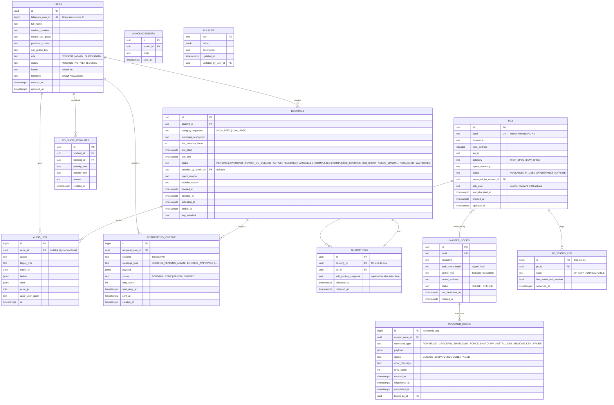

# Database Design — Entity Relationship Diagram
## ReDA Lab Resource Manager

**Document Status:** Draft v1.0
**Last Updated:** 2026-06-30

> PostgreSQL 15+. Mirrors `SDD.md` §9 and `api-specification.md`. All PKs are UUIDv7 (sortable) unless otherwise noted. Timestamps are `TIMESTAMPTZ`, stored as UTC.

---

## 1. ERD (Mermaid)



---

## 2. Detailed Table Definitions

### 2.1 `users`
| Column | Type | Constraints | Notes |
|---|---|---|---|
| id | UUIDv7 | PK | |
| telegram_user_id | BIGINT | UNIQUE NOT NULL | From Telegram |
| full_name | TEXT | NOT NULL | |
| student_number | TEXT | NOT NULL | University ID |
| course_lab_group | TEXT | | Free text |
| preferred_contact | TEXT | | Telegram handle by default |
| ssh_public_key | TEXT | CHECK valid pubkey | Validated on submit |
| role | TEXT | NOT NULL CHECK in (STUDENT,ADMIN,SUPERADMIN) | Default STUDENT |
| status | TEXT | NOT NULL CHECK in (PENDING,ACTIVE,BLOCKED) | Default PENDING |
| locale | TEXT | NOT NULL | Default 'en' |
| timezone | TEXT | NOT NULL | Default 'Asia/Jakarta' |
| created_at, updated_at | TIMESTAMPTZ | NOT NULL DEFAULT now() | |

Indexes: `(telegram_user_id)`, `(status)`.

### 2.2 `pcs`
| Column | Type | Constraints | Notes |
|---|---|---|---|
| id | UUIDv7 | PK | |
| label | TEXT | UNIQUE NOT NULL | e.g. PC-H1 |
| hostname | TEXT | NOT NULL | |
| mac_address | MACADDR | NOT NULL | WoL target |
| lan_ip | INET | NOT NULL | |
| category | TEXT | NOT NULL CHECK in (HIGH_SPEC,LOW_SPEC) | |
| specs_summary | TEXT | | e.g. "RTX 4090, 64GB RAM" |
| status | TEXT | NOT NULL CHECK in (AVAILABLE,IN_USE,MAINTENANCE,OFFLINE) | Default AVAILABLE |
| managed_by_master_id | UUID | FK → master_nodes.id | |
| ssh_user | TEXT | NOT NULL DEFAULT 'labadmin' | account on the PC for master SSH actions |
| last_allocated_at | TIMESTAMPTZ | | For round-robin ordering |
| created_at, updated_at | TIMESTAMPTZ | | |

Indexes: `(category, status)`; `(mac_address)`.

### 2.3 `bookings`
| Column | Type | Constraints | Notes |
|---|---|---|---|
| id | UUIDv7 | PK | |
| student_id | UUID | FK → users.id NOT NULL | |
| category_requested | TEXT | NOT NULL CHECK in (HIGH_SPEC,LOW_SPEC) | |
| workload_description | TEXT | NOT NULL CHECK length BETWEEN 5 AND 300 | |
| slot_duration_hours | INT | NOT NULL CHECK in (SELECT value FROM policies WHERE key='slot_duration_options') | Soft check via app |
| slot_start | TIMESTAMPTZ | NOT NULL | |
| slot_end | TIMESTAMPTZ | NOT NULL | CHECK slot_end > slot_start |
| status | TEXT | NOT NULL | See enum list |
| decided_by_admin_id | UUID | FK → users.id NULL | |
| reject_reason | TEXT | | |
| reclaim_reason | TEXT | | |
| booked_at | TIMESTAMPTZ | DEFAULT now() | |
| decided_at, activated_at, ended_at | TIMESTAMPTZ | | |
| key_installed | BOOLEAN | DEFAULT FALSE | |

Indexes: `(student_id, status)`; `(status)`; `(slot_start, slot_end)` for overlap exclusion; `(category_requested, status)`.

### 2.4 `allocations`
| Column | Type | Constraints | Notes |
|---|---|---|---|
| id | UUIDv7 | PK | |
| booking_id | UUID | FK → bookings.id UNIQUE NOT NULL | 1-to-1 |
| pc_id | UUID | FK → pcs.id NOT NULL | |
| ssh_pubkey_snapshot | TEXT | NOT NULL | Captured from student at allocation |
| allocated_at | TIMESTAMPTZ | DEFAULT now() | |
| released_at | TIMESTAMPTZ | | |

Exclude constraint for slot overlap (PostgreSQL):
```
ADD CONSTRAINT allocations_no_pc_overlap
EXCLUDE USING gist (
    pc_id WITH =,
    tstzrange(slot_start, slot_end) WITH &&
)
WHERE (released_at IS NULL)
```
(Requires `tstzrange` derived from the booking. Since allocation is 1:1 with booking, the booking's slot range is used.)

### 2.5 `master_nodes`
| Column | Type | Constraints |
|---|---|---|
| id | UUIDv7 | PK |
| label | TEXT | UNIQUE NOT NULL |
| hostname | TEXT | NOT NULL |
| auth_token_hash | TEXT | NOT NULL |
| tunnel_type | TEXT | CHECK in (Tailscale,Cloudflare) |
| tunnel_address | TEXT | |
| status | TEXT | NOT NULL DEFAULT 'OFFLINE' |
| last_heartbeat_at | TIMESTAMPTZ | |
| created_at | TIMESTAMPTZ | DEFAULT now() |

### 2.6 `command_queue`
| Column | Type | Constraints |
|---|---|---|
| id | BIGSERIAL | PK (monotonic, used by master long-poll `since=<id>`) |
| master_node_id | UUID | FK NOT NULL |
| command_type | TEXT | NOT NULL CHECK in (POWER_ON,GRACEFUL_SHUTDOWN,FORCE_SHUTDOWN,INSTALL_KEY,REMOVE_KEY,PROBE) |
| payload | JSONB | NOT NULL | `{mac, ip, ssh_user, pubkey}` |
| status | TEXT | NOT NULL DEFAULT 'QUEUED' |
| error_message | TEXT | |
| retry_count | INT | NOT NULL DEFAULT 0 |
| created_at | TIMESTAMPTZ | DEFAULT now() |
| dispatched_at | TIMESTAMPTZ | |
| completed_at | TIMESTAMPTZ | |
| target_pc_id | UUID | FK → pcs.id |

Indexes: `(master_node_id, status, id)` for the long-poll query `WHERE master_node_id=? AND status='QUEUED' AND id>? ORDER BY id`.

### 2.7 `pc_status_log`
Time-series. Consider `timescale` hypertable later if volume grows.
| Column | Type |
|---|---|
| id | BIGSERIAL PK |
| pc_id | UUID FK |
| state | TEXT CHECK in (ON, OFF, UNREACHABLE) |
| has_active_ssh_session | BOOLEAN |
| observed_at | TIMESTAMPTZ DEFAULT now() |

Index `(pc_id, observed_at)`. Retention policy: 30 days raw, downsample to hourly after.

### 2.8 `audit_log`
Append-only. Trigger forbids UPDATE/DELETE.
| Column | Type |
|---|---|
| id | BIGSERIAL PK |
| actor_id | UUID FK NULL |
| action | TEXT NOT NULL (e.g. 'booking.approve') |
| target_type | TEXT |
| target_id | UUID |
| before | JSONB |
| after | JSONB |
| actor_ip | INET |
| actor_user_agent | TEXT |
| at | TIMESTAMPTZ DEFAULT now() |

Index `(target_type, target_id, at)`, `(actor_id, at)`.

### 2.9 `notification_outbox`
At-least-once delivery.
| Column | Type |
|---|---|
| id | BIGSERIAL PK |
| recipient_user_id | UUID FK |
| channel | TEXT NOT NULL DEFAULT 'TELEGRAM' |
| message_kind | TEXT NOT NULL |
| payload | JSONB NOT NULL |
| status | TEXT NOT NULL DEFAULT 'PENDING' |
| retry_count | INT NOT NULL DEFAULT 0 |
| next_retry_at | TIMESTAMPTZ |
| sent_at | TIMESTAMPTZ |
| created_at | TIMESTAMPTZ DEFAULT now() |

Index `(status, next_retry_at)`.

### 2.10 `no_show_penalties`
| Column | Type |
|---|---|
| id | UUIDv7 PK |
| student_id | UUID FK |
| booking_id | UUID FK |
| penalty_start | DATE |
| penalty_end | DATE |
| reason | TEXT |
| created_at | TIMESTAMPTZ DEFAULT now() |

### 2.11 `announcements`
| Column | Type |
|---|---|
| id | UUIDv7 PK |
| admin_id | UUID FK |
| body | TEXT NOT NULL |
| sent_at | TIMESTAMPTZ |

### 2.12 `policies`
Key-value config table for runtime-editable settings.
| Column | Type |
|---|---|
| key | TEXT PK |
| value | JSONB NOT NULL |
| description | TEXT |
| updated_at | TIMESTAMPTZ DEFAULT now() |
| updated_by_user_id | UUID FK |

Seed keys: `slot_duration_options`, `advance_booking_window_days`, `max_active_bookings_per_student`, `no_show_grace_minutes`, `slot_end_warning_minutes`, `slot_end_grace_minutes`, `idle_pc_off_threshold_minutes`, `allow_after_hours`, `auto_approve_low_spec`, `power_on_timeout_seconds`, `power_on_retries`, `lab_safety_timeout_minutes`.

---

## 3. Sequences & Migrations
- All migrations via Alembic. Initial migration: `0001_init`.
- Application-level IDs: UUIDv7 generated in Python (`uuid7` lib) for sortable PKs.
- `command_queue.id` and `notification_outbox.id` use database `BIGSERIAL` because monotonicity across instances is required for the `since=` cursor.

---

## 4. Notable Constraints & Triggers
- **`chk_slot_overlap_allocations`** — GiST exclude constraint (see §2.4).
- **`audit_log_immutable`** — `BEFORE UPDATE OR DELETE` trigger raising an exception.
- **`bookings_state_machine`** — App enforces legal state transitions; a guard in `booking_service` (and a CHECK constraint on `(status, ended_at)` where applicable) ensures no illegal jumps.
- **`users_role_change_audit`** — Trigger writes the role change to `audit_log`.
- **`set_updated_at`** — Generic trigger stamping `updated_at` on the relevant tables.

---

## 5. Sample Queries

### 5.1 Available PC for an allocation
```sql
SELECT p.id
FROM pcs p
WHERE p.category = :category
  AND p.status = 'AVAILABLE'
  AND NOT EXISTS (
      SELECT 1 FROM allocations a
      JOIN bookings b ON b.id = a.booking_id
      WHERE a.pc_id = p.id
        AND a.released_at IS NULL
        AND b.status IN ('APPROVED','ACTIVE','POWER_ON_QUEUED','WAITLISTED')
        AND tstzrange(b.slot_start, b.slot_end) && tstzrange(:start, :end)
  )
ORDER BY p.last_allocated_at NULLS FIRST, p.label
LIMIT 1;
```

### 5.2 Long-poll for master commands
```sql
SELECT * FROM command_queue
WHERE master_node_id = :mn_id
  AND status = 'QUEUED'
  AND id > :since
ORDER BY id ASC
LIMIT 50;
```
(Master marks them `DISPATCHED` atomically via `UPDATE ... WHERE status='QUEUED' RETURNING`.)

### 5.3 Slot-end candidates
```sql
SELECT b.id, b.slot_end, a.pc_id
FROM bookings b
JOIN allocations a ON a.booking_id = b.id
WHERE b.status = 'ACTIVE'
  AND b.slot_end <= now()
  AND b.slot_end > now() - interval '15 minutes';
```

### 5.4 No-show detection
```sql
SELECT b.id
FROM bookings b
WHERE b.status = 'ACTIVE'
  AND b.activated_at < now() - (:no_show_grace || ' minutes')::interval
  AND NOT EXISTS (
      SELECT 1 FROM pc_status_log s
      WHERE s.pc_id = (SELECT pc_id FROM allocations WHERE booking_id = b.id)
        AND s.has_active_ssh_session
        AND s.observed_at > b.activated_at
  );
```

---

## 6. Backup & Retention
- Logical backup nightly (`pg_dump`).
- `pc_status_log`: partition by month; downsample to hourly after 30 days.
- `audit_log`: archive to cold storage (S3) at 12 months; retain 7 years read-only if policy requires.

---

## 7. Seed Data (example)
```sql
INSERT INTO master_nodes(label, hostname, auth_token_hash, tunnel_type, tunnel_address)
VALUES ('lab-a-master', 'master01.lab.local', hash('...'), 'Tailscale', '100.x.x.x');

INSERT INTO pcs(label, hostname, mac_address, lan_ip, category, specs_summary, managed_by_master_id, ssh_user)
VALUES
 ('PC-H1','pch1.lab.local','aa:bb:cc:dd:ee:01','10.0.0.11','HIGH_SPEC','RTX 4090, 64GB', (SELECT id FROM master_nodes WHERE label='lab-a-master'), 'labadmin'),
 ('PC-H2','pch2.lab.local','aa:bb:cc:dd:ee:02','10.0.0.12','HIGH_SPEC','RTX 4090, 64GB', (SELECT id FROM master_nodes WHERE label='lab-a-master'), 'labadmin');
-- ...low-spec PCs...
```